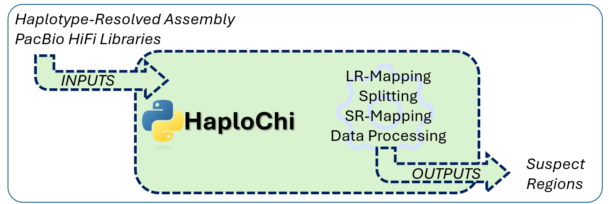
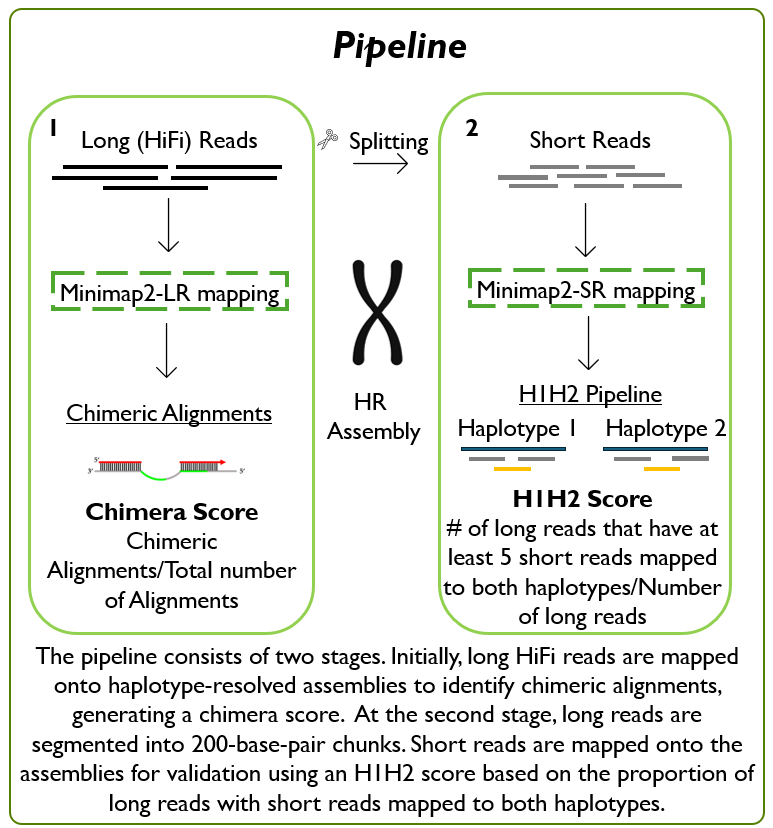
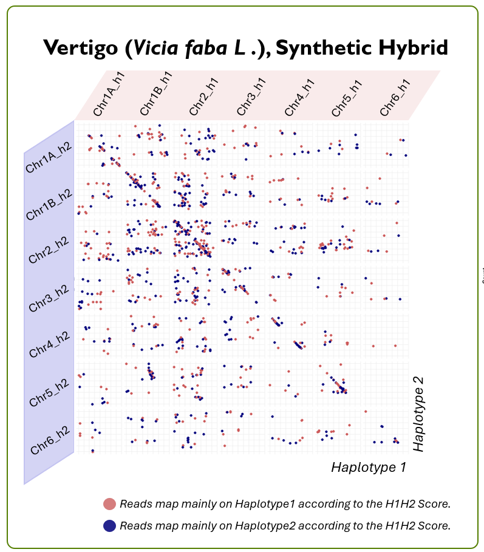
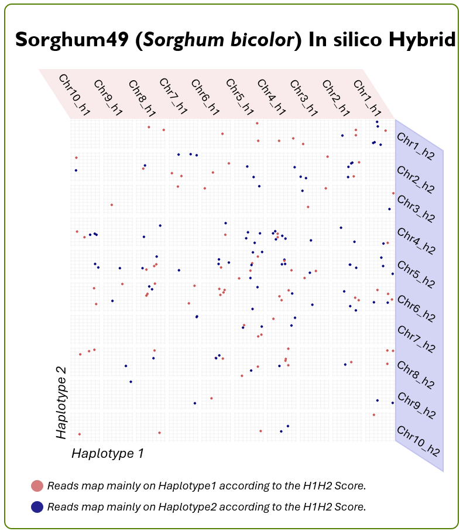

# HaploChi 🧬

> **HaploChi** – Haplotype Chimera Inspector  
> *A tool for evaluating haplotype resolution quality using only PacBio HiFi data.*

---

## 🔷 Overview

<p align="center">
  
</p>

---

## 📖 What is HaploChi?

**HaploChi** is a modular pipeline for assessing the quality of haplotype-resolved genome assemblies. It works entirely with **PacBio HiFi** data and doesn't require parental or other reference datasets.

Genome assemblies of polyploids and heterozygotes often suffer from **haplotype switches** and **chimeric contigs**, especially when haplotypes are highly similar. HaploChi identifies such issues by:

- Mapping long reads to the haplotype-resolved assembly
- Detecting chimeric alignments
- Splitting long reads and performing short-read-style remapping
- Calculating a haplotype balance score (*H1H2 Score*)

This allows users to identify suspect regions and quantify phasing quality.

---
## 🚀 Quick Start

```bash
git clone https://github.com/yourusername/haplochi.git
cd haplochi

# Install Python dependencies
pip install -r requirements.txt

# Run pipeline steps
python haplochi.py split ds.list
python haplochi.py LRmapping sorg_49_HR.fa ds.list
python haplochi.py SRmapping sorg_49_HR.fa s.list
python haplochi.py process sorg_49_HR.fa sorg_49

---

## 🧬 Pipeline Overview
The pipeline has **two main stages**:

1. **Long Read Mapping & Chimera Detection**  
   Long reads are mapped using minimap2. Reads flagged as chimeric are used to compute a **chimera score**:
   > `Chimera Score = Chimeric Alignments / Total Alignments`

2. **Short Read-Style Remapping & H1H2 Scoring**  
   Long reads are split into 200bp chunks and mapped back to both haplotypes. The **H1H2 score** quantifies whether reads support one or both haplotypes:
   > `H1H2 Score = # reads with ≥5 subreads mapped to both haplotypes / total long reads`
   
<p align="center">
  
</p>
---

## 🧪 Example Outputs

<div align="center">
  
  
</div>

<p align="center">
  <sub>
    🔴 Reads map mainly to Haplotype 1 &nbsp; | &nbsp;
    🔵 Reads map mainly to Haplotype 2
  </sub>
</p>

<p align="center">
  <b>Left:</b> Vertigo (Vicia faba) — synthetic hybrid <br/>
  <b>Right:</b> Sorghum49 — in silico hybrid
</p>

---

